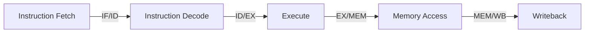

# RV32I 5-Stage Pipelined RISC-V Processor

[](https://github.com/ayushgupta-15/rv32i-5stage-pipelined-processor/actions/workflows/ci.yml)

Designed and verified a custom 32-bit RV32I RISC-V processor in Verilog, evolving from a single-cycle implementation to a fully pipelined 5-stage architecture (IF, ID, EX, MEM, WB). Implemented forwarding, load-use hazard detection with stalling, and branch/jump flush logic to resolve data and control hazards. Developed an automated regression framework with unit, integration, and hazard-specific test suites, achieving full validation across arithmetic, memory, branch, jump, and dependency workloads.

## 🏗️ Architecture Overview

The core implements a classic 5-stage RISC pipeline separated by hardware registers:



### Supported Instructions
- **Arithmetic/Logic (R-type)**: `ADD`, `SUB`, `AND`, `OR`
- **Immediate (I-type)**: `ADDI`
- **Memory (Load/Store)**: `LW`, `SW`
- **Control Flow**: `BEQ`, `BNE`, `JAL`

---

## ⚠️ Hazard Mitigation

Converting a single-cycle processor into a pipelined architecture introduces structural, data, and control hazards. This processor handles them natively in hardware:

1. **Read-After-Write (RAW) Hazards**  
   Mitigated via a **Forwarding Unit** and 3-way ALU multiplexers that dynamically bypass the register file to feed `EX/MEM` or `MEM/WB` results directly into the `EX` stage.
2. **Load-Use Hazards**  
   Mitigated via a **Hazard Detection Unit**. If an instruction tries to read a register currently being loaded from memory (`LW`), the pipeline stalls for 1 cycle by freezing the `PC` and `IF/ID` registers, and inserting a `NOP` bubble into the `ID/EX` boundary.
3. **Control Hazards**  
   Mitigated via **Branch Flush Logic**. Branches are resolved in the `EX` stage. If a branch is taken, the wrong-path instructions fetched in the `IF` and `ID` stages are aggressively flushed (replaced with `NOP`s).

---

## 🧪 Validation & Testing

The strongest component of this project is the automated regression infrastructure. A generic integration testbench (`tb_validation.v`) dynamically loads machine code tests and verifies the final architectural state of the processor against expected memory and register values.

```text
==================================
RV32I VALIDATION SUITE
==================================
PASS: arith
PASS: memory
PASS: branch_taken
PASS: branch_not_taken
PASS: jal
PASS: dependency
PASS: mixed
PASS: load_use
==================================
ALL TESTS EXECUTED
==================================
```

### Running Tests Locally

Ensure you have [Icarus Verilog](http://iverilog.icarus.com/) installed.

```bash
# Run the entire validation suite
make validate

# Run a specific test
make test TEST=load_use
```

## 📁 Repository Structure

- `rtl/core/`: Contains the main `riscv_pipeline.v` top-level datapath module.
- `rtl/components/`: Leaf modules (ALU, Register File, Memories, Control Unit).
- `rtl/pipeline/`: Pipeline registers (`if_id_reg`, etc.), Forwarding Unit, Hazard Detection Unit.
- `tb/`: Simulation and regression testbenches.
- `programs/`: Assembly `.s` files and assembled `.hex` machine code.
- `docs/`: Detailed architectural and timing documentation.
